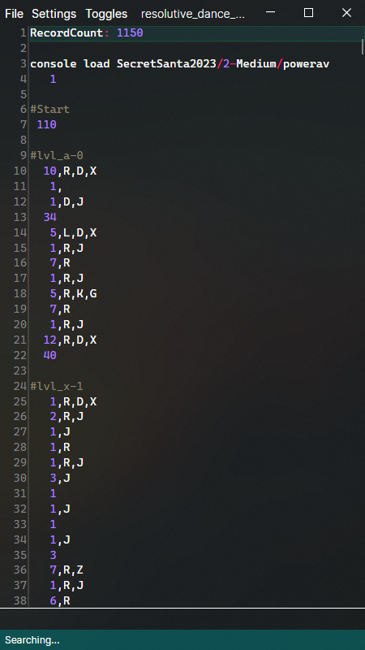

# uTas


<br>

[Celeste](https://github.com/EverestAPI/CelesteTAS-EverestInterop)-inspired universal (game-independent) TAS tooling.

<br clear="left" />
<br />

Examples of games with support for uTas:

- [Moonscars](https://store.steampowered.com/app/1374970/Moonscars/)
  (WIP): https://github.com/jakobhellermann/MoonscarsTasTools



## Architecture

The repository contains the [uTas Editor](./TasEditor), [shared communication code](./Communication) and a parser for
the [uTAS File Format](./TasEditor).

The editor starts listening for TCP connections on a specific port (currently 34729), which in-game TAS mods can connect
to.
They will then exchange messages via simple messages of `<opcode> <data>`, where opcode can
be `SetInfoString`, `KeybindTriggered`, etc.
See [Messages.cs](./Communication/Messages.cs) for what is implemented right now.

A typical exchange of messages looks like this:

```
Client: EstablishConnection
Client: SendKeybinds <keybinding configuration> (not yet implemented)
Server: SendPath /path/to/opened/file.tas

Client: SetInfoString
Client: SetInfoString
Client: SetInfoString
Client: SetInfoString
...

Server: KeybindTriggered StartStop
...
Server: KeybindTriggered FrameAdvance


Client: CloseConnection
```

Since the Editor is game-agnostic, the client is responsible for

- actually parsing the TAS file, and playing it back
- mapping from inputs `R`, `A` to game-specific actions like hold right, attack
- configurable keybindings that are sent to the editor

## TAS Format

```jl
#lvl_1 hashtags begin comments
   5,R       # hold right for 5 frames
   15,D,R,X  # hold down-right and dash
   10        # do nothing for 10 frames

# "Calls", arbitrary `Name, Param0, Param1, ...` interpreted by the client
Set, Player.Speed.X, 100

# "Commands", arbitrary `name Param0, Param1 ...` interpreted by the client
console load 1 2 3


*** # breakpoints: when starting the TAS, execution will fast-forward to the latest breakpoint and stop

 100 # this will run at half spee
***0.5
   5,R
   14,R,J # this will get executed at double speed
***2 
```

## Development

Open in your favorite IDE (Rider, VS, ...) and run `TasEditor.Desktop`.
